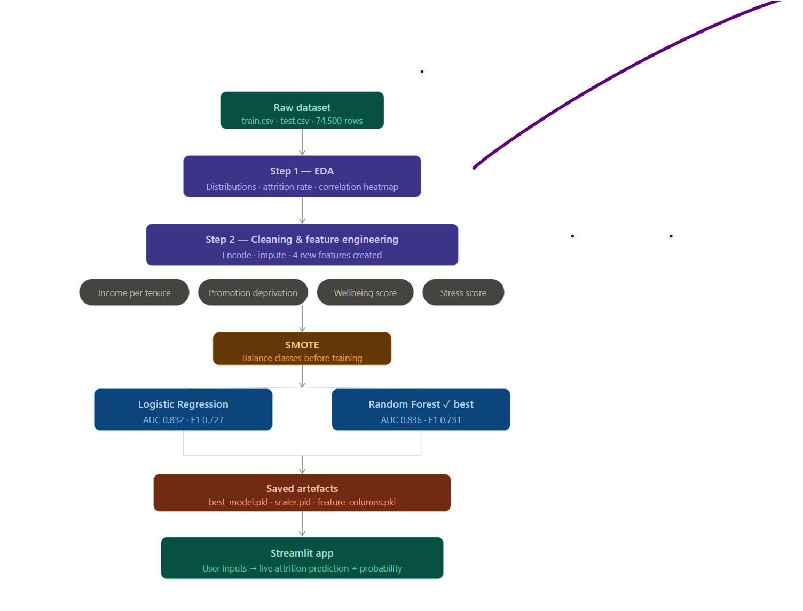

# 🧠 Employee Attrition Prediction

> Predicting which employees are at risk of leaving...

---

## 📌 Problem Statement

Employee attrition costs organisations thousands of pounds per hire in recruitment and training. This project builds a machine learning system to predict which employees are at risk of leaving, enabling HR teams to take proactive steps to improve retention.

---

## 📊 Dataset

| Detail | Info |
|---|---|
| Source | Kaggle — Employee Attrition Classification Dataset |
| Train size | 59,598 rows |
| Test size | 14,900 rows |
| Features | 24 columns |
| Target | `Attrition` — Stayed / Left |

---

## 🗺️ Project Architecture



---

## 🔍 What I Did

### 1. Exploratory Data Analysis (`EDA(Employee).ipynb`)
- Analysed distributions of all numeric and categorical features
- Visualised attrition rate across job roles, overtime, satisfaction levels
- Built correlation heatmap to identify strongest predictors
- Found that overtime, low wellbeing, and promotion stagnation are key risk signals

### 2. Data Cleaning & Feature Engineering (`cleaning_features(Employee).ipynb`)
- Encoded ordinal features with meaningful integer mappings
- One-hot encoded nominal features (Job Role, Marital Status)
- Filled NaN values using median imputation
- Created 4 new meaningful features:

| Feature | Business Logic |
|---|---|
| `Income_per_Tenure_Year` | Underpaid relative to experience = flight risk |
| `Promotion_Deprivation` | Long tenure with few promotions = career stagnation |
| `Wellbeing_Score` | Job satisfaction + work-life balance + recognition combined |
| `Stress_Score` | Overtime + commute distance = burnout risk |

### 3. Model Training (`modeling(Employee).ipynb`)
- Applied **SMOTE** to handle class imbalance before training
- Trained and compared 2 models:

| Model | ROC-AUC | F1 (Left) | Accuracy |
|---|---|---|---|
| Logistic Regression | 0.832 | 0.727 | ~74% |
| Random Forest ✅ | 0.836 | 0.731 | ~74% |

- **Random Forest selected** as the best model
- Evaluated using **ROC-AUC and F1**, not accuracy — because missing an at-risk employee has a real business cost

---

## 📁 Project Structure

```
---

## Testing

### Install Dependencies
```
bash
pip install -r requirements-dev.txt
pytest tests/ -v
pytest tests/ --cov=. --cov-report=html

# Test Files
tests/test_features.py — Unit tests for all feature engineering functions
tests/test_prediction.py — Tests for the prediction pipeline
tests/test_integration.py — End-to-end integration tests


Employee_Attrition/
│
├── features.py                       ← NEW: Reusable feature engineering module
├── app.py                            ← UPDATED: Bug fixes, validation, error handling
├── best_model.pkl                    ← Model artifact
├── scaler.pkl                        ← Scaler artifact
├── feature_columns.pkl               ← Feature columns artifact
│
├── EDA(Employee).ipynb               ← Step 1: Exploratory analysis
├── cleaning_features(Employee).ipynb ← Step 2: Cleaning + feature engineering
├── modeling(Employee).ipynb          ← Step 3: Model training + evaluation
│
├── tests/                            ← NEW: Test suite
│   ├── __init__.py
│   ├── test_features.py
│   ├── test_prediction.py
│   └── test_integration.py
│
├── train.csv                         ← Training data
├── test.csv                          ← Test data
├── Architecture.png                  ← Project architecture diagram
│
├── requirements.txt                  ← UPDATED: Pinned versions
├── requirements-dev.txt              ← NEW: Dev dependencies
├── .gitignore                        ← NEW: Exclude large files
│
└── README.md                         ← This file
```
## 🚀 How to Run Locally

```bash
# 1. Clone the repo
git clone https://github.com/Deepthiprabha21/Employee_Attrition.git
cd Employee_Attrition

# 2. Install dependencies
pip install -r requirements.txt

# 3. Run the Streamlit app
streamlit run app.py
```

---

## 📈 Key Findings

- Employees who work **overtime** are significantly more likely to leave
- **Low wellbeing score** (satisfaction + balance + recognition) is the strongest combined predictor
- Employees with **high promotion deprivation** (long tenure, few promotions) show elevated attrition risk
- **Income relative to tenure** matters more than raw salary alone
- Attrition patterns differ significantly by **job role** and **job level**

---

## ⚠️ What Would Break in Production

- Model trained on synthetic data — real-world distributions may differ significantly
- No retraining pipeline — model will drift over time as workforce changes
- Attrition rate of 47.5% is unrealistically high for most real organisations
- Missing features like team dynamics, manager quality, and market salary benchmarks
- No fairness/bias audit across gender, age, or other protected attributes

---

## 🛠️ Tech Stack

- **Data:** Python, Pandas, NumPy
- **ML:** Scikit-learn, Imbalanced-learn (SMOTE)
- **Visualisation:** Matplotlib, Seaborn
- **App:** Streamlit
- **Deployment:** Streamlit Cloud

---

## 🌐 Live App

👉 [Click here to try the live app](https://employeeattrition-mgpdzmkc2m45ujateszmdv.streamlit.app/)

---

## 👩‍💻 Author

**Deepthi**
MSc Data Science & Analytics — University of Hertfordshire
